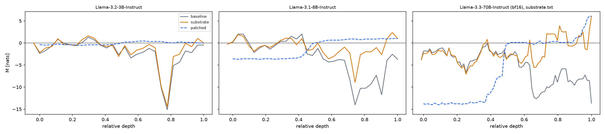
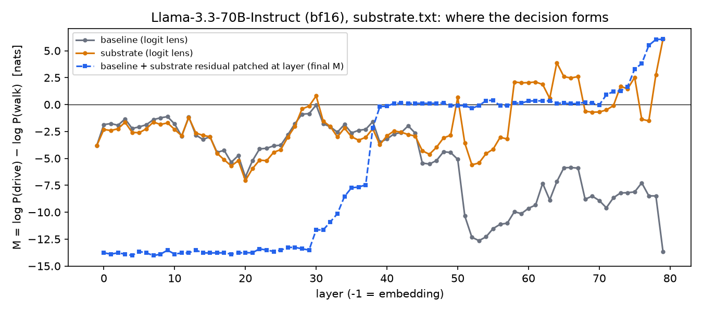
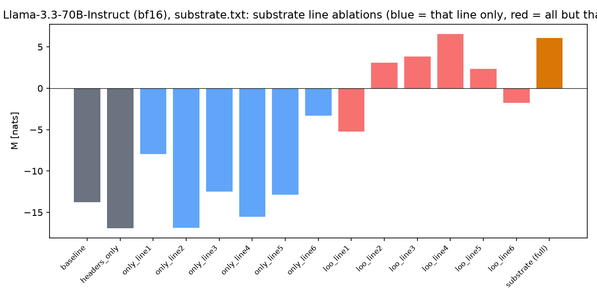
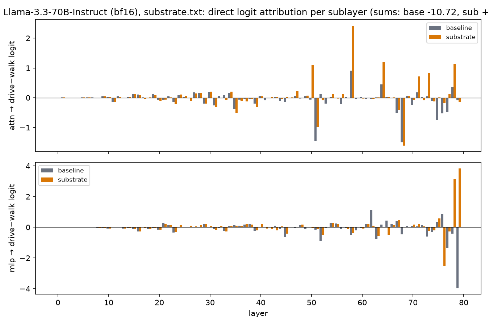
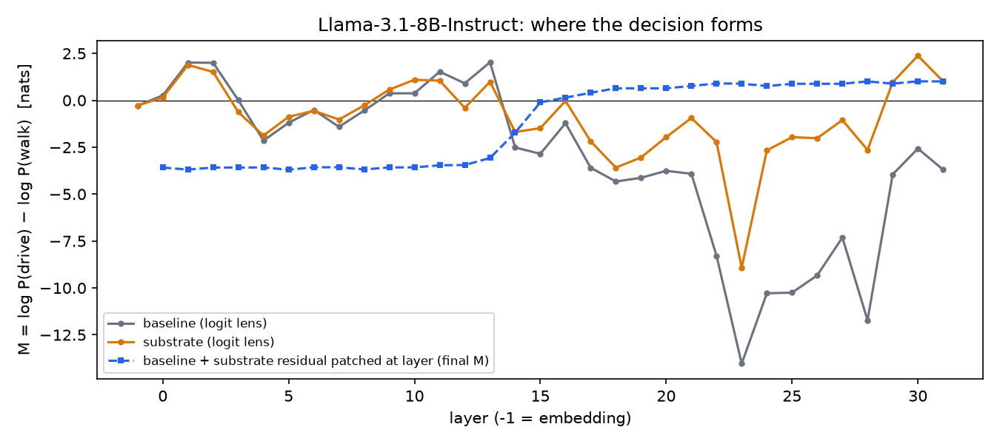
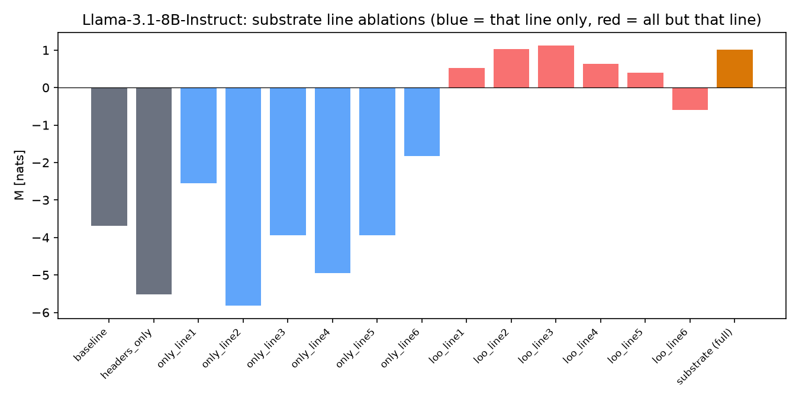
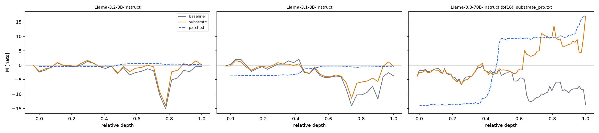

# What the substrate changes inside open-weight models

> **Substrate version.** Everything below was measured on the six-line abstract substrate and the `substrate_pro.txt` that `prompts/` held on 17–18 Sep 2026. On 19 Sep `prompts/substrate.txt` was replaced by a nine-line substrate with a Definitions block and `substrate_pro.txt` / `benchmark_library.txt` were removed. The two retired files are kept verbatim as `cdim_sweep/ladder/L0.txt` and `cdim_sweep/ladder/pro.txt`; the json files record the sha256 of the system text they used. No number here applies to the current `substrate.txt`; the 21 Sep results on it are in `SWEEP_RESULTS.md`.

Measured 17 Sep 2026 with `run_internals.py`. All readouts at the position
that predicts the first answer token, teacher-forced, chat template, bf16
weights. M = log P(drive) − log P(walk) in nats, summed over the surface
forms `Drive`/` drive`/`drive`/…; M > 0 means the model answers Drive.

Prompts as in `prompts/` at commit `fdfc6b7` (baseline question ends with
"Answer with exactly one word: walk or drive"); every substrate is fed as the
system prompt with that same question. Results measured on the previous
wording (without "walk or drive") are kept in `results/old-question-v1/` and
summarised at the end, because the difference between the two is itself a
finding.

## The table

| model | layers | baseline | substrate.txt | substrate_pro.txt | patch flips from layer (sub / pro) | library control (sub / pro) |
|---|---|---|---|---|---|---|
| Llama-3.2-3B | 28 | −0.48 | −0.01 | +0.15 | 14 / 13 | walk / walk |
| Llama-3.1-8B | 32 | −3.69 | **+1.01** | −0.36 | 16 / – | walk / walk |
| Llama-3.3-70B | 80 | −13.78 | **+6.07** | **+17.00** | 41 / 37 | walk / walk |
| Qwen2.5-0.5B | 24 | +0.63 | −1.11 | −0.94 | – | walk / **drive** |
| Qwen2.5-1.5B | 28 | +1.65 | +3.53 | +4.14 | (already drive) | walk / walk |
| Qwen2.5-3B | 36 | +4.25 | +9.75 | +5.00 | (already drive) | **drive** / walk |
| Qwen2.5-7B | 28 | −10.87 | −3.62 | −0.25 | – / – | walk / walk |
| Qwen3-0.6B | 28 | +2.12 | +3.87 | +5.25 | (already drive) | **drive** / walk |
| Qwen3-4B-2507 | 36 | −22.12 | −9.75 | **+18.38** | – / 24 | walk / walk |
| Qwen3-8B | 36 | −14.40 | **+10.75** | **+15.75** | 23 / 23 | walk / walk |

Llama 8B and Qwen 4B+ ran in bf16 on CPU (identical maths, no
quantisation); 70B on 2× A100 80 GB (RunPod); the rest on one 16 GB card.
Qwen3.5 is a hybrid architecture the hooks do not support and was skipped.

## Findings

- **The baseline is not "Walk" in general.** Four of the ten models
  (Qwen2.5-0.5B/1.5B/3B, Qwen3-0.6B) answer Drive with no substrate at all.
  The "shared incorrect baseline" holds for the larger models only
  (Llama 8B/70B, Qwen2.5-7B, Qwen3-4B/8B); Llama 3B sits on the fence.
- **Flips (Walk → Drive) on this question:** Llama 8B with substrate.txt
  only, Llama 70B and Qwen3-8B with both, Qwen3-4B with substrate_pro only
  (−22 → +18), Llama 3B with substrate_pro only and barely (+0.15, p = 0.53).
  Qwen2.5-7B does not flip under either (−3.6 / −0.25).
- **The library control fails on the small Qwens.** Qwen2.5-3B and
  Qwen3-0.6B say Drive for the book under substrate.txt, Qwen2.5-0.5B under
  substrate_pro. For those models the substrate is a Drive bias, not the
  vehicle rule. Every model ≥ 4B keeps the book on Walk under both substrates.
- **Where the decision forms.** In every flipping model the substrate's
  residual at the answer position already carries the decision from the
  middle of the stack: patching it into the baseline run flips the baseline
  from layer 16/32 (Llama 8B), 41/80 (70B; a two-stage climb, to the boundary
  at layers 30–40 and over it at 70+), 23/36 (Qwen3-8B), 24/36 (Qwen3-4B,
  pro). The raw logit lens sees the flip only in the last 2–4 layers, so the
  lens alone underestimates by 10–40 layers how early the constraint is
  installed.
- **Who writes the margin.** Direct logit attribution puts it on the last
  few MLPs plus a handful of heads: 70B MLP L79 (+7.8 with substrate.txt,
  +12.5 with pro) and L78, heads L50H38 / L58H6 / L75H37; Llama 8B MLP L28
  (+) against L29 (−) and heads L25H15, L31H3. The DLA sums reproduce the
  model's M to within 0.1 nats.
- **Which line does it.** Llama 3B and 8B: line 6 ("if the object is a
  vehicle, the user must operate it"). Remove it and both are back below
  zero (−0.98, −0.60). 70B with substrate.txt: line 1 ("perform an activity
  on an object while transporting it"). Remove it and M drops from +6.1 to
  −5.2. 70B with substrate_pro: no line is necessary, every leave-one-out
  stays above +15.8. The redundancy of substrate_pro is what buys the
  margin on the big model; on 8B the same redundancy hurts (+1.0 → −0.4).
- **Substrate_pro is not uniformly better.** It wins on 70B (+17 vs +6),
  Qwen3-4B (+18 vs −10), Qwen3-8B (+16 vs +11) and loses on Llama 8B
  (−0.4 vs +1.0) and Qwen2.5-3B (+5 vs +10).

## Figures

70B, substrate.txt: logit lens for both prompts and the patching curve.

70B line ablations, substrate.txt (blue = that line alone, red = all but
that line):

70B direct logit attribution per sublayer:

Llama 8B, substrate.txt: lens + patching, and the line ablations.

Llama lens overview with substrate_pro:

Every run has the same seven figures and a `summary.md` under
`results/<model>/<precision>[-pro]/`; the numbers are in `internals.json`.

## The question wording moves more than the substrate does

The only difference between `results/old-question-v1/` and the current
results is the tail of the question: "Answer with exactly one word:" vs
"Answer with exactly one word: walk or drive".

| model | baseline old → new | substrate old → new | substrate_pro old → new |
|---|---|---|---|
| Llama-3.2-3B | −3.50 → −0.48 | −1.76 → −0.01 | −1.28 → +0.15 |
| Llama-3.1-8B | −4.00 → −3.69 | +1.50 → +1.01 | +2.98 → −0.36 |
| Llama-3.3-70B | −14.00 → −13.78 | +6.75 → +6.07 | +16.00 → +17.00 |
| Qwen2.5-7B | −8.01 → −10.87 | −0.39 → −3.62 | +3.52 → −0.25 |
| Qwen3-4B-2507 | +0.25 → −22.12 | +0.25 → −9.75 | +9.50 → +18.38 |
| Qwen3-8B | −11.25 → −14.40 | +2.87 → +10.75 | +6.52 → +15.75 |

Three words appended to the question move Qwen3-4B's baseline by 22 nats,
turn Llama 8B's and Qwen2.5-7B's substrate_pro flips into non-flips, and
push Llama 3B from a clear Walk to a coin toss. That is an order of
magnitude more than the bf16-vs-nf4 shift (0.6 nats on 8B) and comparable
to the substrate effect itself. On 70B the wording also moved the
patch-flip layer from 75 to 41 without changing the answer. If the paper
argues reproducibility against an execution-noise floor, the wording of
the question belongs in that floor.

Also measured on the old wording (kept in `old-question-v1/`): 8B in nf4
(same mechanism, M shifted by 0.6 nats), and raw text without the chat
template, where Llama 3B "flips" for both substrates but flips the library
control too.

## Not done

- Tuned lens / J-lens: no fitted lenses for these models.
- Patching at the question positions (the answer position barely attends to
  the substrate lines directly, 1–2 % per line; the effect travels through
  the question tokens).
- Qwen3.5 (hybrid attention), Qwen2.5-14B / Qwen3-14B (no room next to the
  running service).
