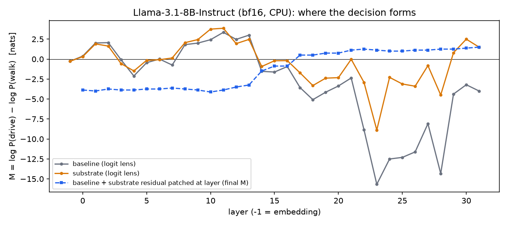
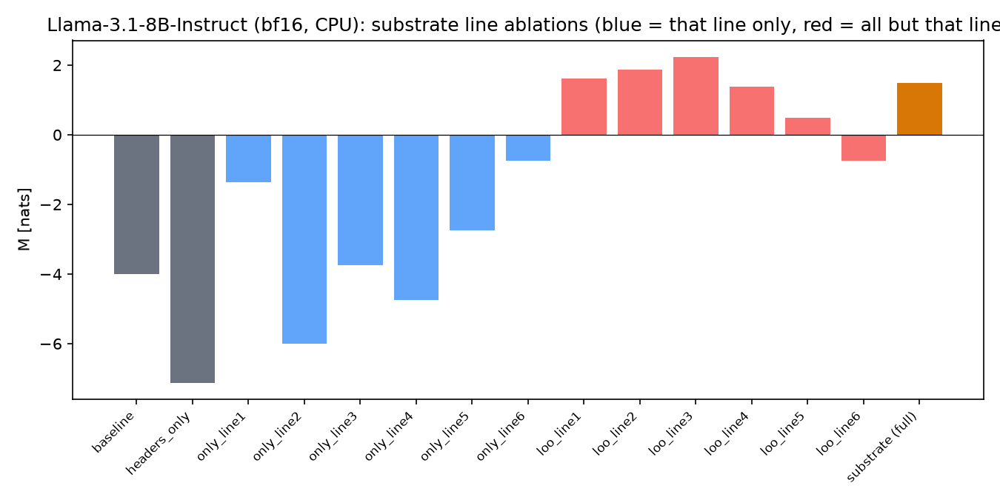
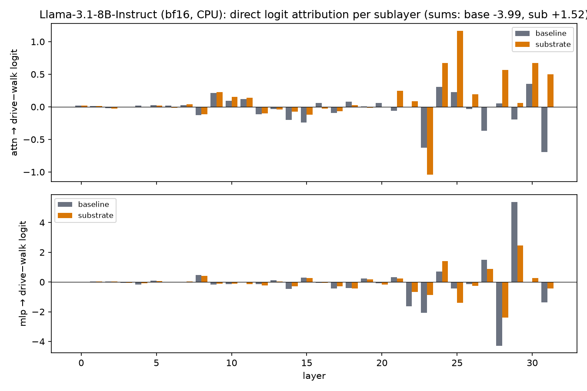
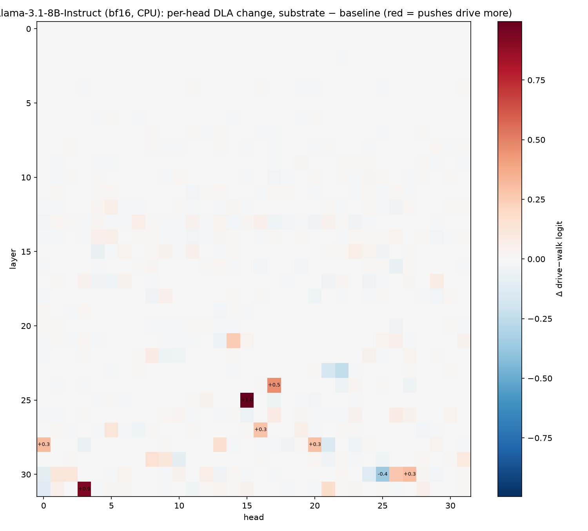
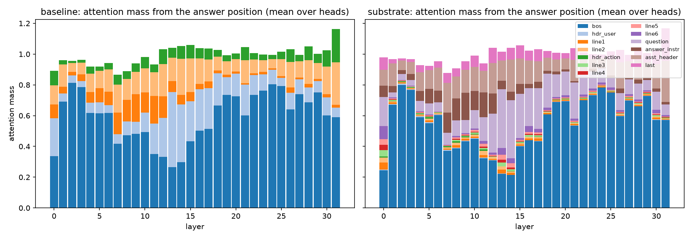
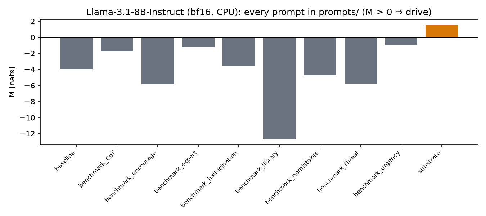
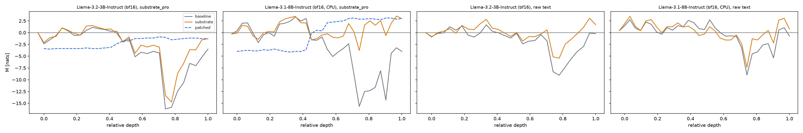

# Baseline vs. substrate: what changes inside Llama 3B / 8B

Measured 17 Sep 2026 with `run_internals.py`. All readouts at the position
that predicts the first answer token (`Drive` / `Walk`), teacher-forced, no
sampling. M = log P(drive) − log P(walk) in nats, summed over surface forms.

| model | precision | baseline M | substrate M | flips? |
|---|---|---|---|---|
| Llama-3.2-3B-Instruct | bf16 (GPU) | −3.50 (Walk) | −1.76 (Walk) | no |
| Llama-3.1-8B-Instruct | bf16 (CPU) | −4.00 (Walk) | **+1.50 (Drive)** | yes |
| Llama-3.1-8B-Instruct | nf4 (GPU) | −6.97 (Walk) | **+0.87 (Drive)** | yes |

## Findings

- **The decision is in the residual stream from layer 17 of 32, the logit lens sees it at layer 30.**
  Patching the substrate run's residual (answer position only) into the
  baseline run flips baseline to Drive for every patch layer ≥ 17. The raw
  logit lens on the substrate run only turns positive at layers 30–31. The
  information is there ~13 layers before it becomes readable through the
  unembedding.
- **Precision shifts M by ~0.6 nats (substrate) and ~3 nats (baseline), the mechanism does not move.**
  nf4 vs bf16: same patch-flip layer (17), same top heads, same MLP layers,
  same line ablation ranking. That is the paper's ε_env measured on one card.
- **One substrate line does the work: line 6.** "If the object is a vehicle,
  the user must operate the object…" Removing it drops 8B from +1.50 to
  −0.75 (back to Walk); alone it reaches −0.75, an order of magnitude more
  than any other line alone. Line 5 ("moving the user without the object does
  not satisfy the objective") helps (−1.0 without it). Lines 1–3 are neutral
  to slightly harmful: without any of them M is *higher* (+1.6 to +2.2).
- **The margin is written by late MLPs and two heads.** Substrate − baseline
  direct logit attribution (8B bf16): MLP L28 +1.9, L23 +1.2, L22 +1.0,
  MLP L29 −2.9 (pushes back), heads L25H15 +1.0 and L31H3 +0.9. The DLA sum
  reproduces the model's M to 0.03 nats.
- **The answer position barely attends to the substrate itself.** 1–2 % of
  attention mass per line (line 6 the most, 8.5 % at layer 0); 55 % goes to
  `<bos>`, 14 % to the question, 13 % to the assistant header. The
  substrate acts through the question's representations, not through direct
  reads at the answer position. Untested next step: patch the *question*
  positions instead of the answer position.
- **3B does not flip and has the same structure.** Substrate moves it from
  −3.5 to −1.8; line 6 is again the only line that matters (without it the
  substrate effect vanishes entirely, −3.5). Too little margin, same
  mechanism.
- **The other benchmark prompts do nothing on either model.** All of CoT,
  encourage, expert, hallucination, no-mistakes, threat stay at Walk;
  "urgency" gets 8B closest (−0.75 bf16) without flipping. The library
  anti-test is strongly Walk (−13 nf4 / −8 bf16 on 8B), as it should be.

## Figures (8B, bf16)

Logit lens per layer for both prompts, plus the patching curve:

Line ablations (blue = only that line, red = all lines but that one):

Direct logit attribution per sublayer:

Per-head DLA change, substrate − baseline (red = pushes Drive):

Attention mass from the answer position onto the prompt parts:

Every prompt in `prompts/`:

Same figures for nf4 in `results/llama-3.1-8b/nf4/` and for 3B in
`results/llama-3.2-3b/`; the raw numbers in each `summary.md` and
`internals.json`.

## substrate_pro.txt and the formatting question (added later the same day)

`substrate_pro.txt` is a bare system prompt (9 lines, mentions books and gas
stations), fed with the baseline question. Chat template unless noted.

| model | input | baseline M | substrate M | substrate_pro M | library anti-test (expect Walk) |
|---|---|---|---|---|---|
| 8B bf16 | chat template | −4.00 | +1.50 | **+2.98** | Walk under both (−5.4 / −4.6) |
| 8B bf16 | raw text | −0.73 | +0.71 | +0.84 | Walk under both (−0.3 / −0.5) |
| 3B bf16 | chat template | −3.50 | −1.76 | −1.28 | Walk under both |
| 3B bf16 | raw text | −0.20 † | **+1.70 †** | **+1.39 †** | **Drive under both** (+0.3 / −0.2 †) |

† raw-text 3B opens every answer with ` **` (markdown), so M is read at the
next token, where the word actually lands (`decision` field in the json).

- **substrate_pro is stronger on 8B** (+3.0 vs +1.5) and the decision enters
  the residual two layers earlier (patch flips from layer 15 instead of 17).
  Same heads (L31H3, L25H15), same MLPs (L28 +, L29 −). Line ablations are
  flat: no single line is necessary any more (dropping any one keeps M ≥
  +1.0); the redundancy is what buys the margin.
- **3B does not flip under either substrate when the prompt goes through the
  chat template.** It only flips on raw text without the chat scaffold, and
  there the library control flips too: the raw-text 3B says "Drive" for the
  book as well. That is a Drive bias induced by the substrate text, not the
  vehicle constraint being applied. Which of these a hosted API reproduces
  depends on whether the provider wraps the prompt in the chat template;
  worth pinning down before counting 3B as a flip.
- **8B is robust to the formatting**: flips under both substrates in both
  input modes, and the library control stays Walk in all four cases.

Figures: `results/llama-3.1-8b/bf16-pro/` (8B, substrate_pro),
`results/llama-3.2-3b/bf16-pro/`, `results/llama-3.2-3b/bf16-raw/`,
`results/llama-3.1-8b/bf16-raw/`; cross-run lens overview in
`results/overview-pro-raw.png`.

## Not done

- Tuned lens / J-lens readouts: no fitted lenses for Llama yet (a J-lens fit
  for 3B is ~20 min on a free 16 GB card).
- 70B: `runpod.sh`, see README.
- Patching at question positions, and per-head attention *from* the
  question tokens *to* line 6.
